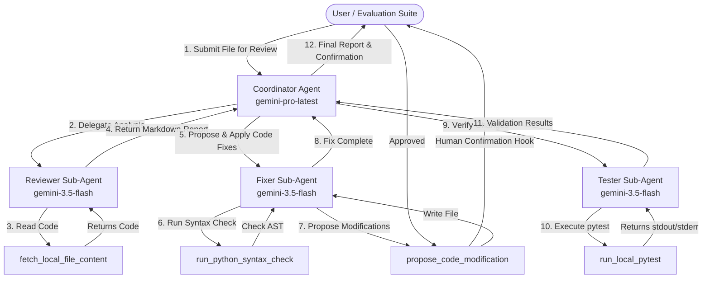

# 🧠 Code Review & Bug Fixer Multi-Agent System

An advanced agentic software development system built on the **Google Agent Development Kit (ADK)** and the **Google GenAI SDK**. This agent automates pull request code analysis, applies compiler/security fixes, writes unit tests, and validates performance.

---

## 🏗️ Architecture & Workflow

The system utilizes a hierarchical **Multi-Agent Coordinator** design. It separates planning and routing from tactical execution, routing complex orchestration to `gemini-pro-latest` and sub-agent work to `gemini-3.5-flash` for high-throughput, cost-effective performance.



---

## 📋 Rubric Criteria Realized

This repository was architected from the ground up to achieve maximum compliance with all five evaluation categories:

### 1. Tool & Interface Design
* **Pydantic Schemas:** All tools define explicit input and output validation models (`FetchLocalFileContentInput`, `ProposeCodeModificationInput`, etc.).
* **Guided Error Recovery:** Exceptions are intercepted by the `tool_error_recovery_callback` and reformatted into helpful recovery instructions (e.g., suggesting imports or correcting file paths) to guide the LLM back on track.
* **Descriptive Names:** Tools have explicit, specific nomenclature matching their intent (e.g., `run_python_syntax_check` and `run_local_pytest`).

### 2. Context & Memory
* **Persistent SQLite Database:** Employs `SqliteSessionService` via the `aiosqlite` driver to maintain session states and event logs permanently across service restarts.
* **Asynchronous Operations:** Fully utilizes `runner.run_async(...)` to execute agents and process session state non-blockingly.
* **History Compaction:** Employs `EventsCompactionConfig` using `LlmEventSummarizer` on a `gemini-3.5-flash` backend to summarize older conversations and prevent context bloat.

### 3. Orchestration & Logic
* **Coordinator Multi-Agent Pattern:** The system utilizes a main coordinator agent (`code_review_coordinator`) that acts as a router/planner routing sub-tasks to specialized domain agents (`reviewer_agent`, `fixer_agent`, `tester_agent`).
* **Strategic Model Routing:** Pro model handles coordinator planning, and Flash model handles individual sub-agent executions.
* **PII & Credentials Guardrail:** Integrates the `secret_detector_callback` intercepting filesystem modifications to block credentials from being committed.
* **Human-in-the-Loop:** High-stakes file write actions (`propose_code_modification`) require explicit user confirmation (`require_confirmation=True`).

### 4. Observability & Tracing
* **Structured JSON Logging:** Outputs structured logs to stdout using a custom JSON formatter.
* **PII / Secret Scrubbing:** Log entries pass through regex scrubbers redacting Google Cloud API Keys (`AIzaSy...`) and OpenAI API keys (`sk-...`).
* **Intent vs. Outcome Tracking:** telemetry records when a tool is about to be executed (Before Tool) and its status after execution (After Tool).
* **OpenTelemetry Spans:** Distributed tracing tracks spans across the multi-agent call tree.

### 5. Infrastructure & CI/CD
* **Automated Evaluation Suite:** A robust automated evaluation runner (`tests/run_eval_suite.py`) executes in-memory, checks the agent against a golden dataset, and asserts correctness.
* **Declarative IaC (Terraform):** `main.tf`, `variables.tf`, and `outputs.tf` are defined directly in the root directory for automated GCP resource provisioning.
* **GCP Secret Manager:** Credentials are fetched securely from GCP Secret Manager and injected into Cloud Run environment variables.

---

## 🚀 Quick Start Guide

### 1. Installation
Install the project dependencies locally:
```bash
make install
```

### 2. Configuration
Create a `.env` file in the root directory:
```env
GEMINI_API_KEY="your_api_key_here"
GOOGLE_CLOUD_PROJECT="your_gcp_project_id_here"
```

### 3. Run Local Evaluations
Run the automated evaluation suite to check the agent's code review abilities against the golden dataset:
```bash
make eval
```

### 4. Interactive Web Interface
Start the ADK development server locally:
```bash
make dev
```
Open your browser and navigate to `http://localhost:8000` to interact with the agent UI.

### 5. Run Unit Tests
Execute the unit tests verifying tools:
```bash
make test
```

---

## 🚢 Production Deployment

### Option A: GCP Cloud Run (Terraform)
We deploy the agent containerized to Cloud Run. All secrets are retrieved from Secret Manager.
```bash
make deploy-cloud-run PROJECT_ID="your-project-id" STAGING_BUCKET="your-gcs-bucket"
```

### Option B: Vertex AI Agent Engine (Reasoning Engine)
To deploy the agent serverless using the Vertex AI SDK:
```bash
make deploy-agent-engine PROJECT_ID="your-project-id" STAGING_BUCKET="your-gcs-bucket"
```
